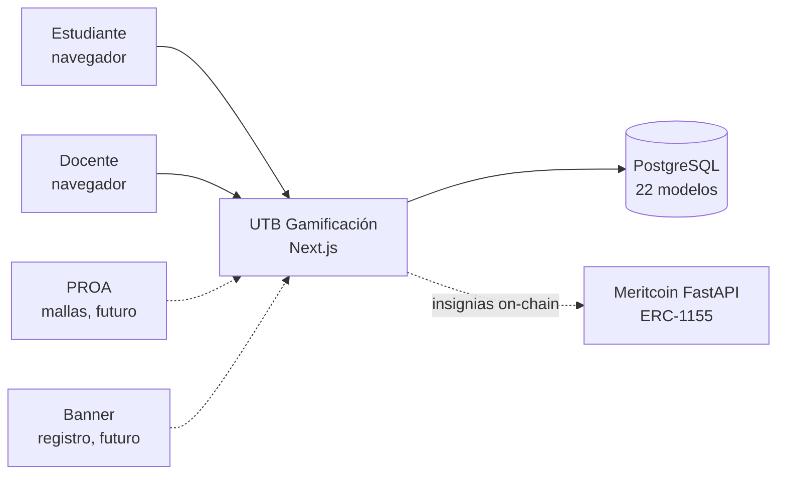
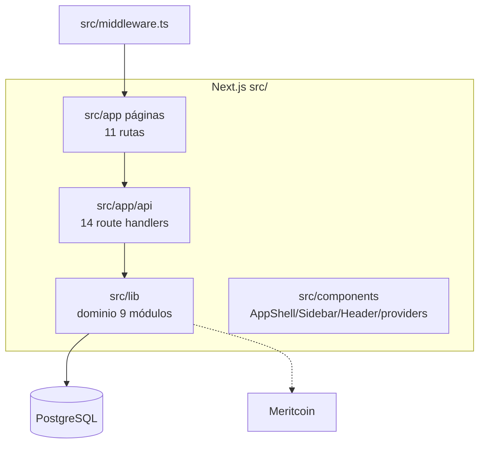
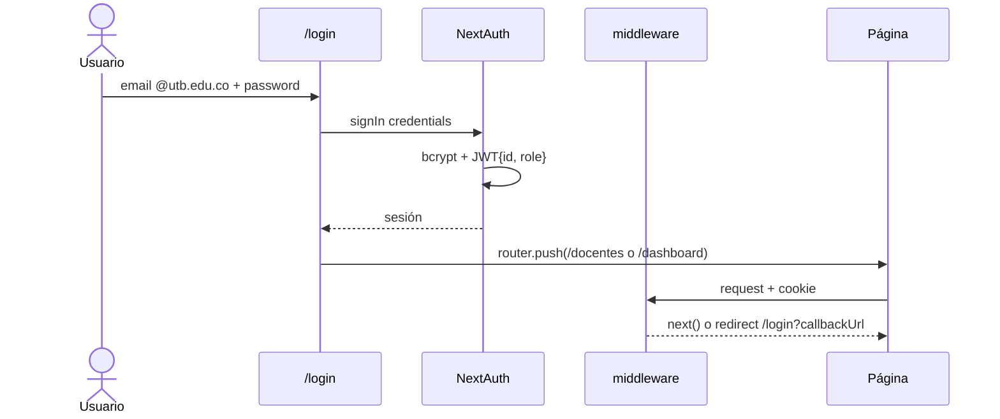
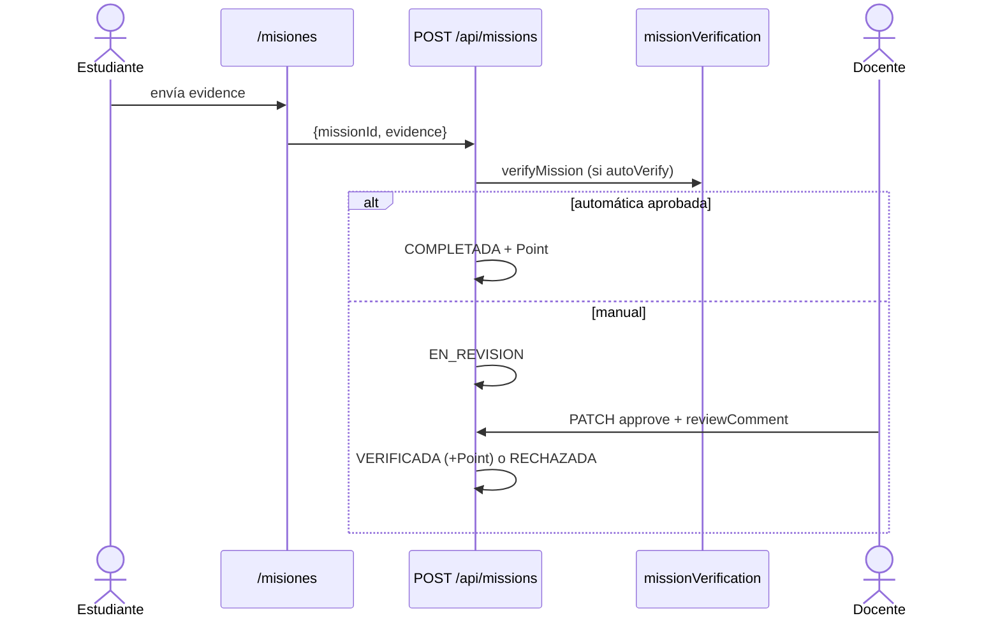
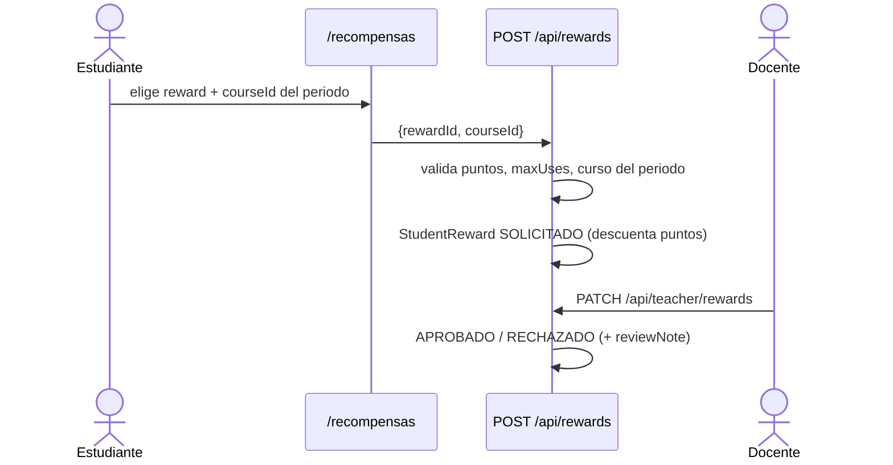
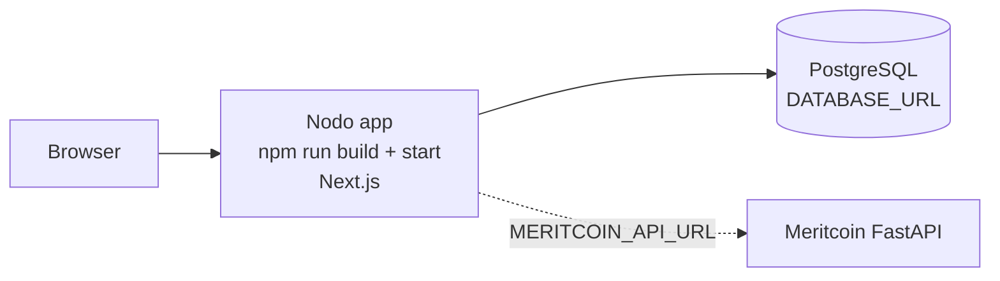

# UTB Gamificación — Documentación de Arquitectura (arc42)

> Fuente de verdad del código: `README.md`, `src/app/README.md`, `src/app/api/README.md`.
> Stack: Next.js 16.3.2 (App Router) · React 19 · Tailwind CSS 4 · PostgreSQL + Prisma 7.9.1 · NextAuth 5 beta · Meritcoin (FastAPI externo).

---

## 1. Introducción y metas

### Propósito

Plataforma web gamificada para que el estudiante de la Universidad Tecnológica de Bolívar visualice su avance en la malla curricular, gane puntos e insignias, canjee recompensas académicas y reciba recomendaciones personalizadas. El docente acompaña por curso, verifica misiones, aprueba canjes y envía rutas recomendadas.

### Stakeholders

| Rol | Interés |
|---|---|
| Estudiante | Ver progreso, misiones, logros, recompensas, estadísticas, perfil y vínculo Meritcoin |
| Docente | Acompañar estudiantes, revisar misiones y canjes, enviar rutas (`/docentes`, `/perfil-docente`) |
| UTB (institución) | Seguimiento académico, alertas de riesgo, futuras fuentes PROA/Banner |
| Equipo de desarrollo | Monolito Next.js simple de operar: un deploy + PostgreSQL |

### Metas de calidad (priorizadas)

1. **Usabilidad por rol**: navegación distinta estudiante/docente (`Sidebar.tsx`, `Header.tsx`), responsive y modo claro/oscuro.
2. **Seguridad**: solo dominio `@utb.edu.co`, bcrypt, JWT, autorización por rol en cada endpoint.
3. **Mantenibilidad**: dominio aislado en `src/lib/*`, 22 modelos Prisma como contrato de datos, tests unitarios (`academic.test.ts`, `missionRules.test.ts`).
4. **Resiliencia externa**: sin Meritcoin arriba, todo lo local sigue funcionando.

---

## 2. Restricciones

| Tipo | Restricción | Origen |
|---|---|---|
| Framework | Next.js 16.3.2 App Router, React 19 | `package.json` |
| UI | Tailwind CSS 4 (`globals.css`, `postcss.config.mjs`) | `package.json` |
| Datos | PostgreSQL + Prisma 7.9.1 con `@prisma/adapter-pg` | `prisma.config.ts`, `src/lib/prisma.ts` |
| Auth | NextAuth 5 beta, Credentials + JWT, **solo `@utb.edu.co`** | `src/lib/auth.ts` |
| Integración | Meritcoin FastAPI externo (`MERITCOIN_API_URL`), emisión ERC-1155, `STU-{id}` + wallet | `src/lib/meritcoin.ts`, `.env.example` |
| Runtime | Node.js 18+, `npm run dev/build/start` | `README.md`, `setup.sh` |
| Datos iniciales | Seed base único `prisma/seed.ts` (ISCO 2019: 10 semestres, 55 cursos, 162 créditos) | `prisma/seed.ts` |

---

## 3. Contexto y alcance

| Vecino | Interfaz | Estado |
|---|---|---|
| Navegador | Páginas `src/app/*/page.tsx` + `fetch /api/*` | Implementado |
| PostgreSQL | Prisma Client (`src/lib/prisma.ts`) | Implementado |
| Meritcoin | `GET /students/{wallet}/summary`, `/badges`, emisión on-chain | Implementado (degradable) |
| PROA / Banner | Sin interfaz aún | Futuro |

---

## 4. Estrategia de solución

1. **Monolito App Router**: `src/app` sirve páginas y `src/app/api/**/route.ts` expone la API privada. Un solo deploy (`next build/start`).
2. **Autorización en dos capas**: `src/middleware.ts` redirige páginas sin cookie a `/login`; **cada** `route.ts` revalida con `requireRole("STUDENT"|"TEACHER")` de `src/lib/session.ts` (el `matcher` excluye `/api`, no confiar solo en el middleware).
3. **Dominio en `src/lib/`**: `academic.ts` (promedio, semestre, tope de créditos), `recommendations.ts` (motor), `streak.ts` + `activity.ts` (racha diaria), `missionRules.ts` + `missionVerification.ts` (auto-verificación), `meritcoin.ts` (espejo + emisión).
4. **Persistencia singleton**: `src/lib/prisma.ts` reutiliza `PrismaClient` vía `globalThis` en dev.
5. **Frontend Client Components**: cada página hace `fetch` a `/api`, con estados carga/error/datos; mutaciones vía `POST/PATCH` con actualización optimista.
6. **Shell por rol**: `layout.tsx` monta `SessionProvider > ThemeProvider > AppShell`; `AppShell` oculta `Sidebar/Header` en `/login`; la navegación cambia según `session.user.role`.

---

## 5. Vista de bloques

### Nivel 1 — Contenedores

### Nivel 2 — Backend (`src/app/api` + `src/lib`)

| Bloque | Archivo(s) | Responsabilidad |
|---|---|---|
| Auth | `api/auth/[...nextauth]/route.ts`, `lib/auth.ts`, `lib/session.ts` | Login `@utb.edu.co` + bcrypt, JWT `{id, role}`, `requireRole`, `jsonUnauthorized/Forbidden` |
| Estudiante | `api/student`, `api/curriculum`, `api/stats` | Perfil+racha, malla con estados por prerrequisito, agregados académicos |
| Gamificación | `api/missions`, `api/badges`, `api/badges/award` | Misiones manuales/automáticas, insignias locales + espejo y emisión Meritcoin |
| Recompensas | `api/rewards`, `api/teacher/rewards` | Catálogo, solicitud `{rewardId, courseId}`, aprobación docente |
| Acompañamiento | `api/teacher`, `api/teacher/notify` | Estudiantes por curso del periodo, revisión de misiones, ruta recomendada + `Activity` |
| Transversales | `api/notifications`, `api/recommendations`, `api/search` | Notificaciones, motor de recomendaciones, búsqueda sin tildes |
| Reglas | `lib/academic|recommendations|streak|activity|missionRules|missionVerification|meritcoin.ts` | Cálculos y cliente Meritcoin |
| Datos | `prisma/schema.prisma` (22 modelos), `seed.ts`, `backfill-meritcoin-ids.ts` | Contrato de datos y datos iniciales |

### Nivel 2 — Frontend (`src/app` + `src/components`)

| Página | Consume | Acción |
|---|---|---|
| `/login` | NextAuth credentials | `signIn`, botones demo (`demo@utb.edu.co`, `docente@utb.edu.co`) |
| `/dashboard` | `/api/student`, `/stats`, `/missions`, `/notifications` | Resumen agregado |
| `/malla` | `GET/POST /api/curriculum` | Estados `APROBADO/EN_CURSO/BLOQUEADO/DISPONIBLE`, selección del periodo |
| `/misiones` | `GET/POST /api/missions` | Evidencia, estados `PENDIENTE→…→VERIFICADA/RECHAZADA` |
| `/logros` | `GET /api/badges`, `POST /api/badges/award` | Progreso, saldo MRT, emisión on-chain |
| `/recompensas` | `GET/POST /api/rewards` | Canje atado a `courseId`, estados `SOLICITADO→APROBADO→USADO/EXPIRADO` |
| `/estadisticas` | `GET /api/stats` | Tendencia y distribución por semestre |
| `/notificaciones` | `GET/PATCH/DELETE /api/notifications` | Marcar leída, seguir `link` |
| `/perfil` | `GET/PATCH /api/student` | Vínculo `wallet 0x + STU-x` |
| `/docentes`, `/perfil-docente` | `/api/teacher*` | Revisar misión/canje, enviar ruta |

---

## 6. Vista de runtime

### R1 — Login y redirección por rol

### R2 — Avance de misión con evidencia

### R3 — Canje de recompensa

Periodo actual en todas las rutas: `YYYY-1` (ene–jun) / `YYYY-2` (jul–dic), filtrando `Enrollment.semesterCode` y `TeacherCourse.period`.

---

## 7. Vista de despliegue

| Elemento | Detalle |
|---|---|
| Build | `npm run build` → `npm run start` (prod) o `npm run dev` (hot reload) |
| Config | `.env`: `DATABASE_URL`, `NEXTAUTH_SECRET/URL`, `MERITCOIN_*` (ver `.env.example`) |
| DB | `npm run db:generate` → `db:push` → `db:seed` → (`db:backfill-meritcoin`, `db:studio`) |
| Instalación nueva | `./setup.sh` (Node vía nvm, Postgres, `.env`, push+seed) o `--skip-db` |
| Credenciales seed | `demo@utb.edu.co/demo123`, `demo2@utb.edu.co/demo1234`, `juanito@utb.edu.co/demo1234`, `docente@utb.edu.co/demo123` |

---

## 8. Conceptos transversales

- **Autenticación**: Credentials, dominio validado en `authorize`, hash bcrypt, sesión JWT con `{id, role}`.
- **Autorización**: `middleware.ts` (páginas) + `requireRole` por endpoint; errores `401 {error:"No autorizado"}`, `403` rol, `404` recurso.
- **Auditoría y racha**: `Activity {action, details}` con `ACTIVITY_ACTIONS` (`LOGIN`, `PAGE_VIEW`, `ACADEMIC_DAILY_ACTIVITY`, `RUTA_RECOMENDADA_DOCENTE`); `calculateStreak` → `{current, best, activeToday}`.
- **Misiones automáticas**: `verificationKey/Value` interpretados por `missionVerification.ts` (créditos, promedio, racha, curso).
- **Meritcoin**: `normalizeMeritcoinStudentId` (`STU-x`), espejo `summary/badges`, `externalId=MERIT-<tokenId>`, provisión custodial de wallet; degradación a local si el API no responde.
- **UX**: tarjetas `rounded-xl border bg-white dark:bg-gray-800`, acento azul/cian, `next-themes` (default light), responsive móvil/escritorio.
- **Calidad de código**: `npm run lint` (ESLint next+TS), `npm run test:unit` (`tsx --test src/lib/**/*.test.ts`), Prettier para formato.

---

## 9. Decisiones de arquitectura

| Decisión | Alternativas | Motivo |
|---|---|---|
| Monolito Next.js (páginas + API) | Frontend y backend separados | Un deploy, equipo pequeño, tipos compartidos, menos infraestructura |
| Prisma + `@prisma/adapter-pg` | SQL crudo / otro ORM | Tipado, migraciones, DX; adapter exigido por Prisma 7 |
| NextAuth Credentials + JWT | OAuth institucional | Sin IdP disponible; dominio + bcrypt suficientes para piloto académico |
| Client Components con `fetch` | Server Components + actions | Interactividad (fimleri, filtros, edición inline) y simplicidad; documentado en `src/app/README.md` |
| Seed base único (`seed.ts`) | Mantener `seed.demo.ts` | Se eliminó la demo para una sola fuente de usuarios de prueba |
| Meritcoin solo para insignias | Todo on-chain | Notas y progreso quedan off-chain; on-chain solo badges ERC-1155 |

---

## 10. Requisitos de calidad (escenarios)

| Atributo | Escenario |
|---|---|
| Usabilidad | Estudiante ve su avance de carrera y siguiente acción en ≤3 clics desde `/dashboard` |
| Rendimiento | Malla y dashboard responden con `GET` agregados por periodo; estados calculados en servidor |
| Seguridad | Sin sesión → `/login`; rol incorrecto → `403`; emails fuera de `@utb.edu.co` rechazados |
| Disponibilidad degradada | Meritcoin caído → insignias locales + `meritcoinAvailable:false`, sin bloquear la app |
| Modificabilidad | Nueva regla de misión = nuevo `verificationKey` en `missionVerification.ts` + test en `missionRules.test.ts` |
| Testeabilidad | `academic.ts` y `missionRules.ts` cubiertos por `test:unit` |

---

## 11. Riesgos y deuda técnica

| Riesgo / deuda | Impacto | Mitigación / estado |
|---|---|---|
| `middleware.matcher` excluye `/api` | Falsa sensación de protección | Cada ruta revalida con `requireRole` — mantener la regla al añadir endpoints |
| 7 warnings `npm run lint` (`` en `logros`, `Sidebar`; vars sin uso en `Header`) | Deuda menor, LCP no optimizado | Migrar a `next/image`, limpiar `Header.tsx` |
| `scripts/` vacía | Ruido | Definir uso o eliminarla |
| `.env` local con `NEXTAUTH_SECRET` de ejemplo y password vacía de Postgres | Riesgo al exponer el repo | Rotar secretos, documentar que es solo desarrollo |
| Nombres inconsistentes (`juanito@` → Angela Lemus, enum `RUTA_ACademica`) | Confusión | Renombrar en próximo seed/migración |
| Sin seed demo | Menos escenarios de prueba | El seed base cubre 3 estudiantes + docente; ampliar si se necesitan casos de riesgo |

---

## 12. Glosario

| Término | Significado |
|---|---|
| Malla curricular | Cursos por semestre (`Program→Semester→Course`) con prerrequisitos (`REQUIRED/COREQUISITE`) |
| Periodo | Código `YYYY-1` (ene–jun) / `YYYY-2` (jul–dic); filtra `Enrollment` y `TeacherCourse` |
| Misión | Reto (`ACADEMICO, PLANIFICACION, MEJORA_CONTINUA, HABITO_ESTUDIO, IMPACTO_SOCIAL`); `StudentMission.status`: `PENDIENTE→EN_PROGRESO→EN_REVISION→COMPLETADA/VERIFICADA/RECHAZADA` |
| Insignia | `Badge.category`: `PROGRESO, RENDIMIENTO, HABITO, COMPETENCIA, IMPACTO_SOCIAL, MERITCOIN` |
| Recompensa / canje | `Reward.category`: `EXAMEN, ASISTENCIA, ENTREGA, OTRO`; `StudentReward.status`: `SOLICITADO→APROBADO/RECHAZADO→USADO/EXPIRADO` |
| Racha | Días consecutivos con `Activity`; `{current, best, activeToday}` |
| STU-id | ID canónico `STU-{n}` en `wallet_registry` de Meritcoin; campo `meritcoinStudentId` |
| Wallet custodial | Dirección `0x` provisionada por la app si el estudiante solo tiene `STU-x` |
| Nivel | 1 Novato (0) · 2 Aprendiz (500) · 3 Explorador (1500) · 4 Avanzado (3000) · 5 Maestro (5000) · 6 Leyenda (8000) |
| Riesgo | `RiskAlert`: `PREREQUISITO_FALTANTE, ATRASO_CREDITOS, BAJO_PROMEDIO, CURSO_EN_RIESGO, SEMESTRE_RETRASADO` (`BAJA→CRITICA`) |
| Recomendación | `CURSO_SUGERIDO, RUTA_ACademica, ALERTA_ATRASO, MEJORA_PROMEDIO, ELECTIVA_RECOMENDADA, RELLENAR_CREDITOS` (prioridad 1=alta) |
