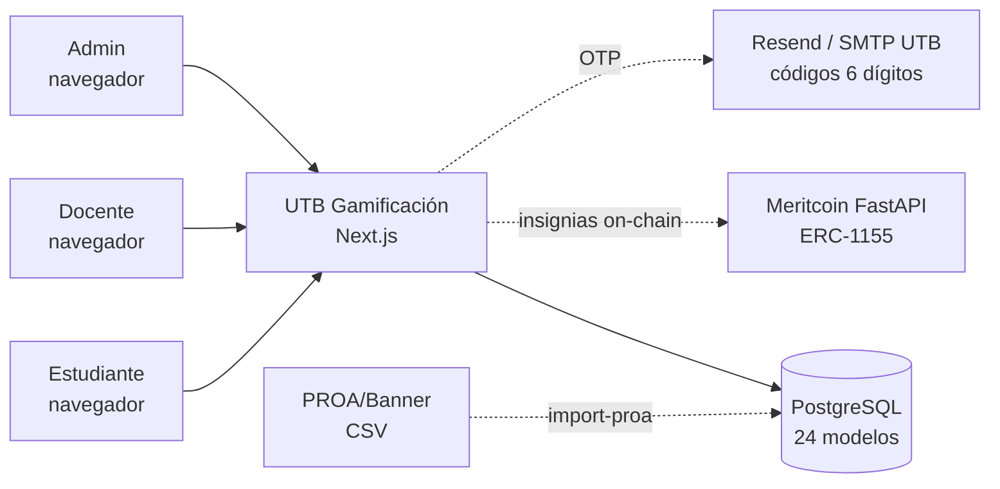
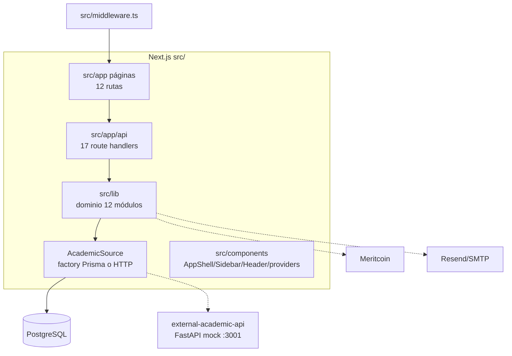
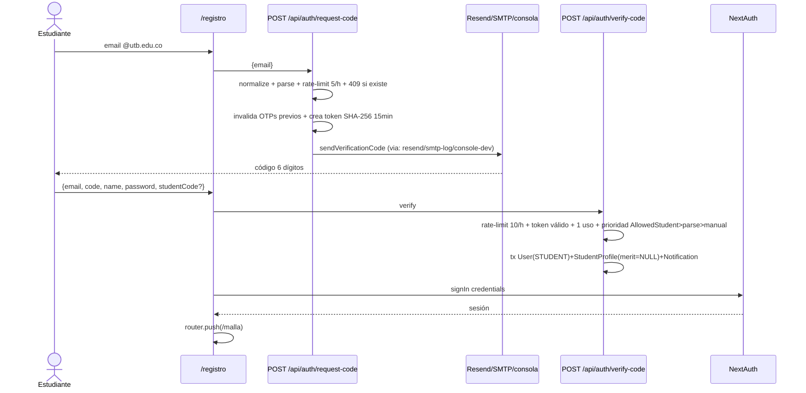
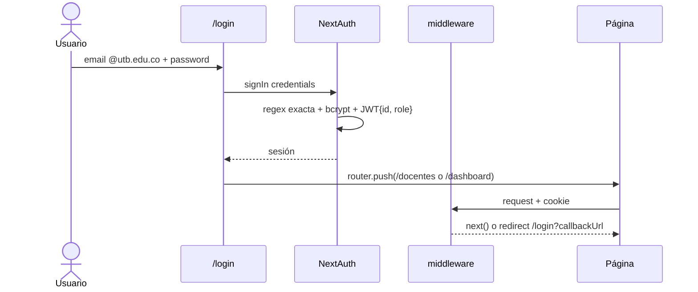
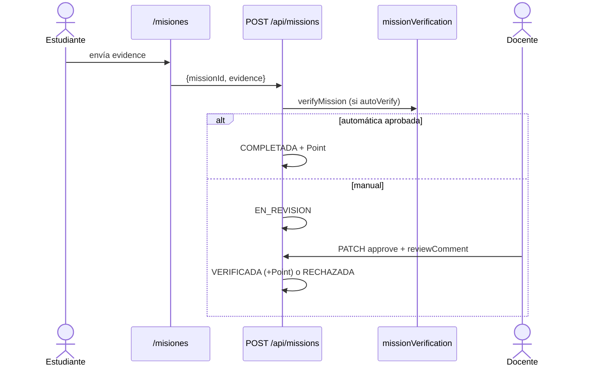
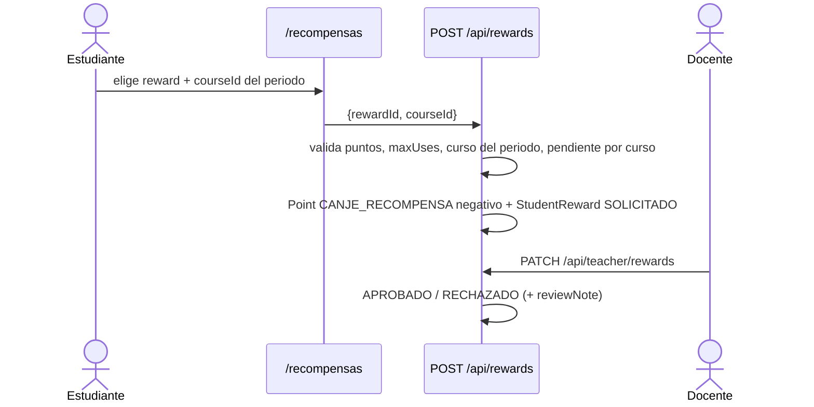
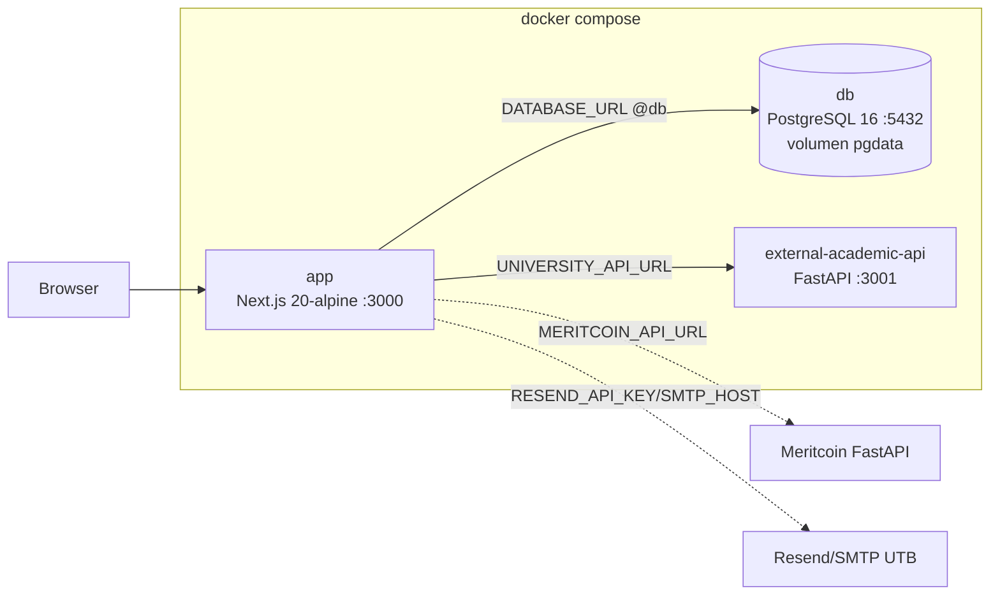

# UTB Gamificación — Documentación de Arquitectura (arc42)

> Fuente de verdad del código: `README.md`, `src/app/README.md`, `src/app/api/README.md`.
> Stack: Next.js 16.3.2 (App Router) · React 19 · Tailwind CSS 4 · PostgreSQL + Prisma 7.9.1 · NextAuth 5 beta · Meritcoin (FastAPI externo).
> Estado: registro institucional con OTP implementado (Fase 1). Ver §11 para fallas corregidas y pendientes.

---

## 1. Introducción y metas

### Propósito

Plataforma web gamificada para que el estudiante de la Universidad Tecnológica de Bolívar visualice su avance en la malla curricular, gane puntos e insignias, canjee recompensas académicas y reciba recomendaciones personalizadas. El docente acompaña por curso, verifica misiones, aprueba canjes y envía rutas recomendadas. El registro es autogestionado con el correo institucional como llave canónica (prueba de posesión vía OTP + aprovisionamiento JIT).

### Stakeholders

| Rol | Interés |
|---|---|
| Estudiante | Registrarse con `@utb.edu.co`, ver progreso, misiones, logros, recompensas, estadísticas, perfil y vínculo Meritcoin |
| Docente | Acompañar estudiantes, revisar misiones y canjes, enviar rutas (`/docentes`, `/perfil-docente`). Alta solo por ADMIN, sin auto-registro |
| ADMIN (nuevo) | Crear cuentas docente vía `POST /api/admin/teachers`. Bootstrap pendiente (ver §11) |
| UTB (institución) | Seguimiento académico, alertas de riesgo, fuente PROA/Banner vía `AllowedStudent` + `scripts/import-proa.ts` |
| Equipo de desarrollo | Monolito Next.js simple de operar: un deploy + PostgreSQL |

### Metas de calidad (priorizadas)

1. **Usabilidad por rol**: navegación distinta estudiante/docente (`Sidebar.tsx`, `Header.tsx`), responsive y modo claro/oscuro. Registro en 2 pasos (`/registro`: solicitar código → verificar y crear cuenta).
2. **Seguridad**: dominio `@utb.edu.co` con regex exacta, posesión del buzón vía OTP SHA-256 (15 min, un solo uso), bcrypt (coste 12 en registro), política de contraseña, rate-limit OTP, autorización por rol en cada endpoint.
3. **Mantenibilidad**: dominio aislado en `src/lib/*` (12 módulos), 24 modelos Prisma como contrato de datos, tests unitarios (`academic.test.ts`, `missionRules.test.ts`, `institutionalEmail.test.ts`).
4. **Resiliencia externa**: sin Meritcoin arriba, todo lo local sigue funcionando; sin proveedor de correo en prod, el registro falla cerrado (no crea cuentas sin verificar).
5. **Integridad académica**: inscripciones `MANUAL` del estudiante no contaminan promedio ni misión `APROBAR_CREDITOS_SEMESTRE` (mitigación parcial, ver §11).

---

## 2. Restricciones

| Tipo | Restricción | Origen |
|---|---|---|
| Framework | Next.js 16.3.2 App Router, React 19 | `package.json` |
| UI | Tailwind CSS 4 (`globals.css`, `postcss.config.mjs`) | `package.json` |
| Datos | PostgreSQL + Prisma 7.9.1 con `@prisma/adapter-pg` | `prisma.config.ts`, `src/lib/prisma.ts` |
| Auth login | NextAuth 5 beta, Credentials + JWT, regex exacta `^[a-z0-9._-]+@utb\.edu\.co$` | `src/lib/auth.ts`, `src/lib/institutionalEmail.ts` |
| Registro | OTP 6 dígitos (SHA-256, TTL 15 min, 5 intentos, un solo uso) + JIT `User(STUDENT)+StudentProfile`; docentes sin auto-registro | `src/app/api/auth/request-code/route.ts`, `verify-code/route.ts`, `src/lib/emailProvider.ts` |
| Rate-limit | En memoria (`Map`): 5/h `request-code` por email+IP, 10/h `verify-code` por email. Single-instance; migrar a Redis en multi-instancia | `src/lib/rateLimit.ts` |
| Correo | `RESEND_API_KEY` (real) → `SMTP_HOST` (solo log estructurado, nodemailer pendiente) → `console-dev` (solo no-prod). En prod sin proveedor: error 500 controlado | `src/lib/emailProvider.ts`, `.env.example` |
| Password | Mínimo 8 caracteres, 1 mayúscula y 1 número (`validatePassword`); hash bcrypt 12 en registro | `src/lib/institutionalEmail.ts` |
| Integración | Meritcoin FastAPI externo (`MERITCOIN_API_URL`), emisión ERC-1155, `STU-{id}` + wallet | `src/lib/meritcoin.ts`, `.env.example` |
| Fuente académica | Desacoplada tras `AcademicSource`: `PrismaAcademicSource` (por defecto) o `HttpAcademicSource` según `UNIVERSITY_API_ENABLED=true` + `UNIVERSITY_API_URL` | `src/lib/getAcademicSource.ts`, `.env.example` |
| Despliegue | `docker compose up -d` (3 servicios: `app`, `db` PostgreSQL 16, `external-academic-api`). Alternativa local Node + PostgreSQL vía `./setup.sh` (solo Linux/macOS) | `docker-compose.yml`, `Dockerfile`, `README.md` §Instalación |
| Runtime | Node.js 20 en imagen `node:20-alpine`. Fuera de Docker: Node.js 18+, `npm run dev/build/start` | `Dockerfile`, `README.md`, `setup.sh` |
| Datos iniciales | Seed base único `prisma/seed.ts` (ISCO 2019: 10 semestres, 55 cursos, 162 créditos). Destructivo: 22 `deleteMany()`. En Docker solo se ejecuta si la tabla `users` está vacía | `prisma/seed.ts`, `prisma/seed-if-empty.ts` |
| Import académico | CSV PROA/Banner → `AllowedStudent` (`email,studentCode,programCode,admissionYear,fullName?`) | `scripts/import-proa.ts`, `npm run db:import-proa` |

---

## 3. Contexto y alcance

| Vecino | Interfaz | Estado |
|---|---|---|
| Navegador | Páginas `src/app/*/page.tsx` + `fetch /api/*` (12 páginas, incluye `/registro`) | Implementado |
| PostgreSQL | Prisma Client (`src/lib/prisma.ts`), 24 modelos | Implementado |
| Proveedor correo | `POST https://api.resend.com/emails` o log `SMTP_HOST`; `console-dev` en desarrollo | Implementado con fallback (SMTP real pendiente) |
| Meritcoin | `GET /students/{wallet}/summary`, `/badges`, emisión on-chain | Implementado (degradable) |
| PROA / Banner | Sin API directa; CSV → `AllowedStudent` vía `scripts/import-proa.ts` | Parcial (import manual, sin sync automática) |

---

## 4. Estrategia de solución

1. **Monolito App Router**: `src/app` sirve páginas y `src/app/api/**/route.ts` expone la API privada. Un solo deploy (`next build/start`).
2. **Autorización en dos capas**: `src/middleware.ts` redirige páginas sin cookie a `/login` (rutas públicas: `/login`, `/registro`, `/api/auth`); **cada** `route.ts` revalida con `requireRole("STUDENT"|"TEACHER"|"ADMIN")` de `src/lib/session.ts` (el `matcher` excluye `/api`, no confiar solo en el middleware).
3. **Registro con correo como llave**: `POST /api/auth/request-code` (normaliza + rate-limit + crea `EmailVerificationToken`) → `POST /api/auth/verify-code` (verifica OTP + aprovisiona JIT). Prioridad de resolución: `AllowedStudent` (PROA) > `parse(email)` (código en local-part) > `studentCode` manual validado. Docentes solo vía `POST /api/admin/teachers` con `requireAdmin`.
4. **Dominio en `src/lib/`**: `institutionalEmail.ts` (normalizar/parsear/validar), `emailProvider.ts` (Resend/SMTP-log/consola), `rateLimit.ts`, `academic.ts` (promedio, semestre, tope de créditos), `recommendations.ts` (motor), `streak.ts` + `activity.ts` (racha diaria), `missionRules.ts` + `missionVerification.ts` (auto-verificación), `meritcoin.ts` (espejo + emisión).
5. **Integridad académica defensiva**: `getAverageGrade` y `APROBAR_CREDITOS_SEMESTRE` ignoran `Enrollment.source === "MANUAL"` sin aval (mitigación parcial; `POST /api/curriculum` aún crea `CURSANDO MANUAL`, ver §11).
6. **Persistencia singleton**: `src/lib/prisma.ts` reutiliza `PrismaClient` vía `globalThis` en dev.
7. **Frontend Client Components**: cada página hace `fetch` a `/api`, con estados carga/error/datos; mutaciones vía `POST/PATCH` con actualización optimista. `/registro` es pública y hace auto-`signIn` tras verificar.
8. **Shell por rol**: `layout.tsx` monta `SessionProvider > ThemeProvider > AppShell`; `AppShell` oculta `Sidebar/Header` en `/login` y `/registro`; la navegación cambia según `session.user.role`.

---

## 5. Vista de bloques

### Nivel 1 — Contenedores

> `AcademicSource` es el único punto de acceso a datos académicos de `curriculum` y `student`. Con `UNIVERSITY_API_ENABLED=false` opera sobre Prisma y la API externa no participa.

### Nivel 2 — Backend (`src/app/api` + `src/lib`)

| Bloque | Archivo(s) | Responsabilidad |
|---|---|---|
| Auth login | `api/auth/[...nextauth]/route.ts`, `lib/auth.ts`, `lib/session.ts` | Login `@utb.edu.co` (regex exacta) + bcrypt, JWT `{id, role}`, `requireRole(string|string[])`, `requireAdmin`, `jsonUnauthorized/Forbidden` |
| Registro institucional | `api/auth/request-code/route.ts`, `api/auth/verify-code/route.ts`, `lib/institutionalEmail|emailProvider|rateLimit.ts` | OTP SHA-256 15 min/un solo uso/5 intentos, rate-limit 5/h y 10/h, JIT `User+StudentProfile+Notification`, `meritcoinStudentId=NULL` |
| Admin | `api/admin/teachers/route.ts` | Alta docente solo `ADMIN` (bcrypt 12). Sin auto-registro `TEACHER` |
| Estudiante | `api/student`, `api/curriculum`, `api/stats` | Perfil+racha, malla con estados por prerrequisito, agregados académicos. `student` y `curriculum` leen vía `getAcademicSource()` |
| Gamificación | `api/missions`, `api/badges`, `api/badges/award` | Misiones manuales/automáticas, insignias locales + espejo y emisión Meritcoin |
| Recompensas | `api/rewards`, `api/teacher/rewards` | Catálogo, solicitud `{rewardId, courseId}` (`@@unique[studentId,rewardId,courseId]`, pendiente por curso, débito `CANJE_RECOMPENSA`), aprobación docente |
| Acompañamiento | `api/teacher`, `api/teacher/notify` | Estudiantes por curso del periodo, revisión de misiones, ruta recomendada + `Activity` |
| Transversales | `api/notifications`, `api/recommendations`, `api/search` | Notificaciones, motor de recomendaciones, búsqueda sin tildes |
| Reglas | `lib/academic|recommendations|streak|activity|missionRules|missionVerification|meritcoin.ts` | Cálculos y cliente Meritcoin; `academic` y `APROBAR_CREDITOS_SEMESTRE` excluyen `MANUAL` |
| Fuente académica | `lib/academicSource.ts` (interfaz + tipos), `getAcademicSource.ts` (factory), `prismaAcademicSource.ts`, `httpAcademicSource.ts` | Abstracción del origen de datos de malla y estudiante. `EXTERNAL_API_UNAVAILABLE` → las rutas responden 503, no 500 |
| Datos | `prisma/schema.prisma` (24 modelos), `seed.ts`, `seed-if-empty.ts`, `backfill-meritcoin-ids.ts`, `scripts/import-proa.ts` | Contrato de datos, datos iniciales ISCO 2019, seed condicional, backfill `STU-{id}`, import CSV → `AllowedStudent` |

### Nivel 2 — Frontend (`src/app` + `src/components`)

| Página | Consume | Acción |
|---|---|---|
| `/login` | NextAuth credentials | `signIn`, enlace a `/registro`, botones demo |
| `/registro` (nueva, pública) | `POST /api/auth/request-code`, `POST /api/auth/verify-code` | Paso 1: pedir código. Paso 2: `{code, name, password, studentCode?}` → auto-`signIn` → `/malla` |
| `/dashboard` | `/api/student`, `/stats`, `/missions`, `/notifications` | Resumen agregado |
| `/malla` | `GET/POST /api/curriculum` | Estados `APROBADO/EN_CURSO/BLOQUEADO/DISPONIBLE`, selección del periodo (crea `CURSANDO MANUAL`) |
| `/misiones` | `GET/POST /api/missions` | Evidencia, estados `PENDIENTE→…→VERIFICADA/RECHAZADA` |
| `/logros` | `GET /api/badges`, `POST /api/badges/award` | Progreso, saldo MRT, emisión on-chain |
| `/recompensas` | `GET/POST /api/rewards` | Canje atado a `courseId`, estados `SOLICITADO→APROBADO→USADO/EXPIRADO` |
| `/estadisticas` | `GET /api/stats` | Tendencia y distribución por semestre |
| `/notificaciones` | `GET/PATCH/DELETE /api/notifications` | Marcar leída, seguir `link` |
| `/perfil` | `GET/PATCH /api/student` | Vínculo `wallet 0x + STU-x` |
| `/docentes`, `/perfil-docente` | `/api/teacher*` | Revisar misión/canje, enviar ruta |

---

## 6. Vista de runtime

### R0 — Registro con correo institucional (nuevo)

### R1 — Login y redirección por rol

### R2 — Avance de misión con evidencia

Nota: `APROBAR_CREDITOS_SEMESTRE` solo suma `APROBADO + UNIVERSITY` del periodo (`missionVerification.ts:139-147`). `getAverageGrade` excluye `MANUAL` salvo `APROBADO` con nota (`academic.ts:72-80`).

### R3 — Canje de recompensa

Unicidad `@@unique([studentId, rewardId, courseId])` (`schema.prisma:542`): permite `maxUses>1` en cursos distintos; el conteo `existingUses` sigue siendo global por `rewardId` (ver §11).

Periodo actual en todas las rutas: `YYYY-1` (ene–jun) / `YYYY-2` (jul–dic), filtrando `Enrollment.semesterCode` y `TeacherCourse.period`. Lógica duplicada con `getMonth() < 6` en 6 archivos (ver §11).

---

## 7. Vista de despliegue

| Elemento | Detalle |
|---|---|
| Build | `docker compose up -d`. Imagen `node:20-alpine`; no requiere Node ni PostgreSQL en el host. El `.env` se inyecta por `env_file` en runtime, nunca horneado en la imagen (`.dockerignore`) |
| Servicios | `app` :3000 · `db` PostgreSQL 16 :5432 (volumen `utb-gamificacion_pgdata`, sobrevive a `down`) · `external-academic-api` :3001 |
| Orden de arranque | `app` espera `db` healthy. Dentro: `prisma db push` → `db:seed-if-empty` → `npm run dev` |
| Seed en arranque | `prisma/seed-if-empty.ts` siembra **solo si `users` está vacía**; `seed.ts` es destructivo (22 `deleteMany()`). `SEED_IF_EMPTY=false` lo desactiva. Así un equipo nuevo levanta con datos y nadie pierde los suyos en un `up` posterior |
| Config | `.env` (plantilla `.env.example`): `DATABASE_URL`, `NEXTAUTH_SECRET/URL`, `MERITCOIN_*`, `RESEND_API_KEY` o `SMTP_HOST/PORT/USER/PASS`, `EMAIL_FROM`, `ADMIN_EMAIL`, `UNIVERSITY_API_URL/KEY/ENABLED` |
| DB (fuera de Docker) | `db:generate` → `db:push` → `db:seed` → (`db:import-proa ./proa.csv`, `db:backfill-meritcoin`, `db:studio`) |
| Instalación nueva | Docker: `cp .env.example .env` + `docker compose up -d`. Local: `./setup.sh` (Node vía nvm, Postgres, `.env`, push+seed) o `--skip-db`; solo Linux/macOS. `setup.sh` aún no genera las vars de correo/ADMIN (ver §11) |
| Choke point despliegue | Un PostgreSQL local en el 5432 choca con el puerto publicado del contenedor. Detenerlo o remapear el puerto en `docker-compose.yml` |
| Credenciales seed | `demo@utb.edu.co/demo123`, `demo2@utb.edu.co/demo1234`, `juanito@utb.edu.co/demo1234`, `docente@utb.edu.co/demo123` (datos demo con inconsistencias, ver §11) |

---

## 8. Conceptos transversales

- **Autenticación**: Credentials, dominio con regex exacta en `authorize` (`auth.ts:36`), hash bcrypt (coste 10 en seed, 12 en registro/admin), sesión JWT con `{id, role}`.
- **Registro y posesión**: OTP 6 dígitos (`crypto.randomInt`), hash SHA-256, TTL 15 min, 5 intentos, un solo uso (`consumedAt`), invalidación de previos, 409 `ALREADY_REGISTERED`, 429 por rate-limit. `meritcoinStudentId` queda `NULL` hasta Moodle real.
- **Autorización**: `middleware.ts` (páginas; públicas `/login`, `/registro`, `/api/auth`) + `requireRole(string|string[])` y `requireAdmin()` por endpoint; errores `400` entrada, `401 {error:"No autorizado"}`, `403` rol, `404` recurso, `409` conflicto, `429` rate-limit.
- **Política de contraseña**: `validatePassword` (8+, mayúscula, número). Sin flujo de recuperación/reset (ver §11).
- **Auditoría y racha**: `Activity {action, details}` con `ACTIVITY_ACTIONS` (`LOGIN`, `PAGE_VIEW`, `ACADEMIC_DAILY_ACTIVITY`, `RUTA_RECOMENDADA_DOCENTE`); `calculateStreak` → `{current, best, activeToday}`. El registro crea `Notification` de bienvenida.
- **Integridad académica**: `source UNIVERSITY/MANUAL`; promedio y `APROBAR_CREDITOS_SEMESTRE` excluyen `MANUAL` no avalado. `POST /api/curriculum` aún crea `CURSANDO MANUAL` (ver §11).
- **Misiones automáticas**: `verificationKey/Value` interpretados por `missionVerification.ts` (créditos, promedio, racha, curso).
- **Meritcoin**: `normalizeMeritcoinStudentId` (`STU-x`), espejo `summary/badges`, `externalId=MERIT-<tokenId>`, provisión custodial de wallet; degradación a local si el API no responde.
- **Correo**: `emailProvider.ts` con cascada Resend → SMTP-log → consola-dev; prod sin proveedor falla cerrado. SMTP real (nodemailer) pendiente.
- **Rate-limit**: en memoria, sin persistencia ni limpieza de buckets; suficiente para piloto single-instance.
- **UX**: tarjetas `rounded-xl border bg-white dark:bg-gray-800`, acento azul/cian, `next-themes` (default light), responsive móvil/escritorio. `/registro` y `/login` sin `Sidebar/Header` (`AppShell.publicRoutes`).
- **Calidad de código**: `npm run lint` (ESLint next+TS; 7 warnings preexistentes), `npm run test:unit` (`academic.test.ts`, `missionRules.test.ts`, `institutionalEmail.test.ts`), Prettier para formato.
- **Fuente académica**: `getAcademicSource()` se resuelve en cada request; `AcademicStudentData.source` (`"prisma" | "http"`) deja auditar de dónde salió la respuesta. Con la API externa caída, `HttpAcademicSource` lanza `EXTERNAL_API_UNAVAILABLE` y `curriculum`/`student` responden `503`, para que el fallo sea distinguible de un error de la app.

---

## 9. Decisiones de arquitectura

| Decisión | Alternativas | Motivo | Estado |
|---|---|---|---|
| Monolito Next.js (páginas + API) | Frontend y backend separados | Un deploy, equipo pequeño, tipos compartidos, menos infraestructura | Vigente |
| Prisma + `@prisma/adapter-pg` | SQL crudo / otro ORM | Tipado, migraciones, DX; adapter exigido por Prisma 7 | Vigente |
| NextAuth Credentials + JWT + OTP institucional | OAuth/SSO institucional (Google/Microsoft) | Sin IdP disponible; OTP prueba posesión del buzón sin operar SSO; dominio + bcrypt + JIT suficientes para piloto | Implementado Fase 1 |
| JIT con prioridad `AllowedStudent > parse(email) > código manual` | Solo allowlist cerrada / solo auto-registro abierto | Funciona sin CSV PROA el día 1 y mejora cuando llega el CSV; el email numérico da `studentCode` directo | Implementado |
| Resend → SMTP-log → consola-dev | Solo SMTP / solo Resend | Desbloquea dev sin credenciales y prod con una sola var; SMTP UTB real queda como integración pendiente | Implementado con deuda (§11) |
| Rate-limit en memoria | Redis/Upstash desde el día 1 | Cero infra extra para piloto; documentado para migrar en multi-instancia | Implementado con deuda |
| `StudentReward @@unique[studentId,rewardId,courseId]` | `@@unique[studentId,rewardId]` original | El original impedía `maxUses:2` (P2002); el nuevo permite re-uso por curso | Implementado |
| `PointSource.CANJE_RECOMPENSA` para débitos | Reutilizar `MISION_COMPLETADA` negativo | El re-uso contaminaba agregados por `source`; el nuevo enum separa canjes | Implementado |
| Interfaz `AcademicSource` + toggle por env | Cambiar las queries de `curriculum`/`student` in situ cuando llegue la API real | Permite validar la integración con el mock sin reescribir las rutas ni tocar la BD host; el dominio no depende del origen | Implementado |
| `external-academic-api` (FastAPI) como mock | Apuntar la app a la API real de la universidad de una vez | Falta contrato real; el mock fija la forma de la respuesta y sirve de tests de contrato mientras tanto | Vigente, pendiente contrato real |
| `docker compose` con 3 servicios | `setup.sh` como flujo principal | `setup.sh` es solo Linux/macOS y exige Postgres en el host; Docker hace el proyecto reproducible en Windows/macOS/Linux sin Node ni Postgres | Implementado (`setup.sh` queda como Opción B) |
| Seed condicional (`seed-if-empty`) en el arranque | `db:seed` en el `command` del contenedor | `seed.ts` es destructivo (22 `deleteMany()`); ejecutarlo en cada `up` borraría los datos de quien ya trabaja | Implementado |
| `RiskAlert.student → StudentProfile` con cascade | `studentId` suelto sin FK | Evita huérfanos y permite joins; `Recommendation` ya tenía FK | Implementado |
| `MANUAL` excluido de promedio y `APROBAR_CREDITOS_SEMESTRE` | Cambiar `POST /curriculum` a `INSCRITO` + aval | Parche defensivo mínimo sin romper UX de planificación; el cambio de estado queda pendiente | Mitigación parcial |
| Client Components con `fetch` | Server Components + actions | Interactividad y simplicidad; documentado en `src/app/README.md` | Vigente |
| Seed base único (`seed.ts`) | Mantener `seed.demo.ts` | Una sola fuente de usuarios de prueba | Vigente (con inconsistencias §11) |
| Meritcoin solo para insignias | Todo on-chain | Notas y progreso quedan off-chain; on-chain solo badges ERC-1155 | Vigente |

---

## 10. Requisitos de calidad (escenarios)

| Atributo | Escenario | Estado |
|---|---|---|
| Usabilidad | Estudiante se registra con `@utb.edu.co` y llega a `/malla` en ≤3 pasos (pedir código → verificar → auto-login) | Implementado (`/registro`) |
| Usabilidad | Estudiante ve su avance de carrera y siguiente acción en ≤3 clics desde `/dashboard` | Vigente |
| Rendimiento | Malla y dashboard responden con `GET` agregados por periodo; estados calculados en servidor | Vigente |
| Seguridad | Sin sesión → `/login`; rol incorrecto → `403`; emails fuera de `@utb.edu.co` rechazados por regex exacta | Implementado |
| Seguridad | OTP: código aleatorio 6 dígitos, SHA-256, 15 min, un solo uso, 5 intentos, 409 si ya registrado, 429 si abusa | Implementado (con deuda: contador `attempts` no cubre todos los fallos, ver §11) |
| Seguridad | Docente no puede auto-registrarse; `POST /api/admin/teachers` exige `ADMIN` | Implementado (bootstrap ADMIN pendiente) |
| Disponibilidad degradada | Meritcoin caído → insignias locales + `meritcoinAvailable:false`, sin bloquear la app | Vigente |
| Disponibilidad degradada | Sin `RESEND_API_KEY`/`SMTP_HOST` en prod → registro responde 500 controlado, no crea cuentas sin verificar | Implementado |
| Modificabilidad | Nueva regla de misión = nuevo `verificationKey` en `missionVerification.ts` + test en `missionRules.test.ts` | Vigente |
| Modificabilidad | Nuevo proveedor de correo = una rama en `emailProvider.ts` (firma `sendVerificationCode`) | Implementado |
| Testeabilidad | `academic.ts`, `missionRules.ts` e `institutionalEmail.ts` cubiertos por `test:unit` (8/8 pass) | Implementado; falta integración API |

---

## 11. Riesgos, deuda técnica y fallas

### 11.1 Fallas corregidas en esta iteración (con evidencia)

| # | Falla | Evidencia de corrección |
|---|---|---|
| F1 | Login aceptaba cualquier sufijo con `endsWith("@utb.edu.co")` | `src/lib/auth.ts:36` + `src/lib/institutionalEmail.ts:12` usan regex exacta `/^[a-z0-9._-]+@utb\.edu\.co$/` |
| F2 | Sin registro: altas solo vía `seed.ts` | `POST /api/auth/request-code`, `POST /api/auth/verify-code`, `/registro`, `EmailVerificationToken`, `AllowedStudent`, `scripts/import-proa.ts` |
| F3 | `StudentReward @@unique[studentId,rewardId]` bloqueaba `maxUses:2` | `prisma/schema.prisma:542` → `@@unique([studentId, rewardId, courseId])`; pendiente por curso en `rewards/route.ts:201-208` |
| F4 | Débitos de canje con `source:MISION_COMPLETADA` | `rewards/route.ts:221` usa `CANJE_RECOMPENSA` (`schema.prisma:274`) |
| F5 | `RiskAlert.studentId` sin FK (huérfanos) | `schema.prisma:475-477` relation + cascade + `@@index`; `StudentProfile.riskAlerts` |
| F6 | Promedio y `APROBAR_CREDITOS_SEMESTRE` farmeables con `MANUAL` | `academic.ts:72-80` y `missionVerification.ts:139-147` excluyen `MANUAL` |
| F7 | `requireRole` solo un rol; `ADMIN` sin helper | `session.ts:36-67` acepta `string|string[]` + `requireAdmin()` |
| F8 | `/registro` protegida / con shell | `middleware.ts:5` y `AppShell.tsx:8` incluyen `/registro` como pública |
| F9 | Sin validación de contraseña/código ni tests de email | `institutionalEmail.ts:59-75` + `institutionalEmail.test.ts` (4 casos) |

### 11.2 Fallas y deuda pendientes (no ocultar)

| Riesgo / deuda | Impacto | Evidencia | Acción requerida |
|---|---|---|---|
| `POST /api/curriculum` aún crea `CURSANDO MANUAL` | El estudiante infla `selectedCredits`, `getCurrentSemester`, `enrolledCourses` (recompensas) y vista docente aunque el promedio/misión ya filtran | `curriculum/route.ts:143` | Cambiar a `INSCRITO MANUAL` + aval docente/PROA para pasar a `CURSANDO UNIVERSITY` |
| `MANUAL APROBADO` aún cuenta en promedio | `getAverageGrade` permite `MANUAL` si `status===APROBADO`; hoy ninguna ruta crea ese estado, pero el modelo lo permite | `academic.ts:78` | Excluir `MANUAL` siempre o impedir transición `MANUAL→APROBADO` sin aval |
| `AVANZAR_SEMESTRE` y `CERO_REPROBADOS` no filtran `source` | Inconsistencia con `APROBAR_CREDITOS_SEMESTRE`; riesgo si aparece `MANUAL APROBADO/REPROBADO` | `missionVerification.ts:172-220` | Aplicar el mismo filtro `source !== MANUAL` |
| Contador `attempts` inefectivo en OTP | `verify-code` solo incrementa en `STUDENT_CODE_REQUIRED`; un código erróneo con `token=null` retorna 400 sin incrementar ni bloquear por código | `verify-code/route.ts:49-58` | Incrementar por email+ventana o guardar intento fallido; añadir limpieza de tokens expirados (cron) |
| Rate-limit en memoria sin limpieza | `Map` crece sin TTL cleanup; se pierde en multi-instancia/serverless | `rateLimit.ts:8-22` | Migrar a Redis/Upstash; podar `buckets` expirados |
| `SMTP_HOST` no envía, solo loguea | En UTB real el OTP quedaría en logs, no en el buzón; prod sin Resend falla cerrado | `emailProvider.ts:46-51` | Integrar nodemailer con `SMTP_PORT/USER/PASS` + TLS; no loguear el código en prod |
| `import-proa.ts` usa `endsWith` laxo | Aceptaría `x@utb.edu.co.evil.com` si el CSV viene contaminado | `scripts/import-proa.ts:32` | Reutilizar `normalizeInstitutionalEmail` |
| Bootstrap `ADMIN` inexistente | `ADMIN_EMAIL` está en `.env.example:17` pero ningún seed/route lo crea; `POST /api/admin/teachers` queda inusable en instalación limpia | `.env.example:17`, `admin/teachers/route.ts:14`, `seed.ts` sin `ADMIN` | Seed/bootstrap que crea `ADMIN` desde `ADMIN_EMAIL` + password inicial rotada; añadir `GET /api/admin/teachers` y UI mínima |
| Sin recuperación de contraseña | Usuario que olvida clave queda bloqueado; sin reset vía OTP | No existe `request-reset/reset-password` | Reutilizar `EmailVerificationToken` para reset |
| Login sin lockout ni rate-limit | `authorize` no limita intentos; solo OTP tiene rate-limit | `auth.ts:30-68` | Añadir rate-limit + log `Activity(LOGIN_FAILED)` + delay exponencial |
| `middleware` solo verifica existencia de cookie | No valida firma/expiración; confía en que cada API revalida | `middleware.ts:25-28`, `config.matcher` excluye `/api` | Mantener regla "cada ruta revalida"; evaluar `auth()` en middleware/proxy |
| Periodo `YYYY-1/2` duplicado con `getMonth()<6` | Desfase con calendario UTB real; 6 implementaciones divergentes | `missionVerification.ts:14`, `recommendations.ts:177`, `stats/rewards/curriculum/student route.ts`, `seed.ts:13` | Centralizar en `src/lib/period.ts` + tabla `AcademicPeriod` |
| Doble fuente académica `AcademicRecord` vs `Enrollment` | `AcademicRecord` usa `courseCode` string sin FK; `getAverageGrade` prioriza historial y puede divergir de `Enrollment` | `schema.prisma:226-241`, `academic.ts:63-70` | Definir fuente canónica (PROA→`Enrollment UNIVERSITY`) y deprecar/mapear `AcademicRecord` |
| Seed demo inconsistente | `juanito@utb.edu.co` → "Angela Lemus", `STU-2/3/4` ficticios, `meritcoinStudentId` inventados | `seed.ts:320,375,427,420`, `README.md:255` | Renombrar a `angela.lemus@` o nombre coherente; `meritcoinStudentId=NULL` en seed y backfill real desde Moodle |
| Typo `RUTA_ACademica` fosilizado | Enum + código + migración histórica con mayúscula intermedia | `schema.prisma:452`, `recommendations.ts:5,158`, `migrations/..._add_rewards/migration.sql:35` | Migración de rename `RUTA_ACademica→RUTA_ACADEMICA` + alias temporal |
| Cobertura solo unitaria de `lib` | Sin tests de `request-code/verify-code`, canje, `curriculum`, `teacher`; regresiones silenciosas | `test:unit` solo `src/lib/**/*.test.ts` | Añadir tests de integración API (OTP, JIT, canje `maxUses`, `MANUAL`) |
| 7 warnings `npm run lint` | `` en `logros`/`Sidebar`, vars sin uso en `Header` | Salida `npm run lint` | Migrar a `next/image`, limpiar `Header.tsx` |
| `setup.sh` desactualizado | No genera vars de correo/ADMIN ni ejecuta `db:import-proa` | `setup.sh`, `.env.example:9-17` | Extender setup con prompts Resend/SMTP + `ADMIN_EMAIL` |
| `getCurrentSemester` incluye `MANUAL` | Auto-selección puede anclar semestre actual ficticio | `academic.ts:39-44` | Filtrar `source===UNIVERSITY` para semestre oficial; mostrar "planeado" aparte |

### 11.3 Supuestos abiertos con UTB

- Formato real del correo (¿código numérico vs `nombre.apellido`?) determina si `AllowedStudent` es obligatorio. El código soporta ambos, pero sin CSV PROA los nominales exigen `studentCode` manual.
- Proveedor de correo oficial (¿SMTP UTB con credenciales? ¿Resend permitido?). Hoy solo Resend envía de verdad.
- Calendario oficial de periodos (¿corte ene–jun exacto? ¿verano/intersemestral?) para reemplazar `getMonth()<6`.
- `ADMIN` bootstrap: ¿quién es el primer admin y cómo rota su clave?
- Moodle/Meritcoin: `userid` real para `STU-{id}` (dejar `NULL` hasta tenerlo).

---

## 12. Glosario

| Término | Significado |
|---|---|
| Malla curricular | Cursos por semestre (`Program→Semester→Course`) con prerrequisitos (`REQUIRED/COREQUISITE`) |
| Periodo | Código `YYYY-1` (ene–jun) / `YYYY-2` (jul–dic); filtra `Enrollment` y `TeacherCourse`. Lógica duplicada pendiente de centralizar |
| Correo canónico | `email @utb.edu.co` normalizado (trim+lower+regex exacta); llave de identidad |
| OTP | Código 6 dígitos (`crypto.randomInt`), hash SHA-256, TTL 15 min, un solo uso; `EmailVerificationToken` |
| JIT | Aprovisionamiento justo a tiempo: `verify-code` crea `User(STUDENT)+StudentProfile` tras poseer el buzón |
| `AllowedStudent` | Allowlist PROA/Banner (`email→studentCode, programId, admissionYear`); cargada por `scripts/import-proa.ts` |
| `code` vs `named` | `parse(email)`: `code` = local-part numérico 8-10 dígitos (da `studentCode` directo); `named` = nombre (requiere allowlist o código manual) |
| `MANUAL` / `UNIVERSITY` | `Enrollment.source`: auto-selección del estudiante vs registro oficial; solo `UNIVERSITY` cuenta para métricas verificables |
| Misión | Reto (`ACADEMICO, PLANIFICACION, MEJORA_CONTINUA, HABITO_ESTUDIO, IMPACTO_SOCIAL`); `StudentMission.status`: `PENDIENTE→EN_PROGRESO→EN_REVISION→COMPLETADA/VERIFICADA/RECHAZADA` |
| Insignia | `Badge.category`: `PROGRESO, RENDIMIENTO, HABITO, COMPETENCIA, IMPACTO_SOCIAL, MERITCOIN` |
| Recompensa / canje | `Reward.category`: `EXAMEN, ASISTENCIA, ENTREGA, OTRO`; débito `PointSource.CANJE_RECOMPENSA`; `StudentReward.status`: `SOLICITADO→APROBADO/RECHAZADO→USADO/EXPIRADO`; unicidad por `(studentId, rewardId, courseId)` |
| Racha | Días consecutivos con `Activity`; `{current, best, activeToday}` |
| STU-id | ID canónico `STU-{n}` en `wallet_registry` de Meritcoin; campo `meritcoinStudentId` (`NULL` hasta Moodle real; no usar `STU-2/3/4` demo en prod) |
| Wallet custodial | Dirección `0x` provisionada por la app si el estudiante solo tiene `STU-x` |
| Nivel | 1 Novato (0) · 2 Aprendiz (500) · 3 Explorador (1500) · 4 Avanzado (3000) · 5 Maestro (5000) · 6 Leyenda (8000) |
| Riesgo | `RiskAlert` (FK a `StudentProfile`): `PREREQUISITO_FALTANTE, ATRASO_CREDITOS, BAJO_PROMEDIO, CURSO_EN_RIESGO, SEMESTRE_RETRASADO` (`BAJA→CRITICA`) |
| Recomendación | `CURSO_SUGERIDO, RUTA_ACademica, ALERTA_ATRASO, MEJORA_PROMEDIO, ELECTIVA_RECOMENDADA, RELLENAR_CREDITOS` (prioridad 1=alta; typo pendiente de rename) |
